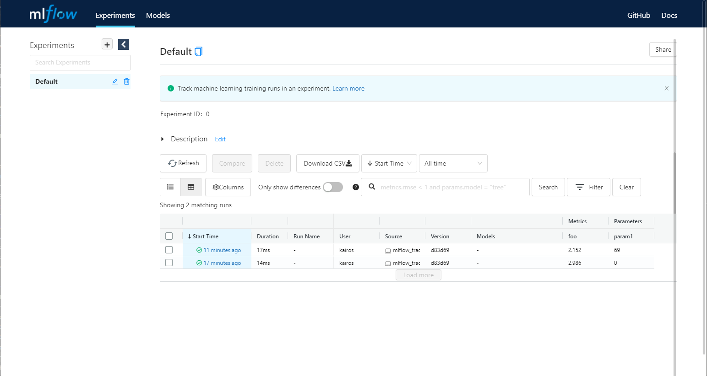

# Introduction (소개)

## Prerequests (사전 작업)
conda, python3.8
```
$ conda create -n mlflow python=3.8
$ conda activate mlflow
$ python --version
Python 3.8.12
```

## Quick start (빠른 시작)

### Install(설치)
```shell
$ pip install mlflow
$ mlflow --version
mlflow, version 1.22.0
```

### 기본 동작 이해하기
mlflow 공식 github에서 예제 코드를 통해 mlflow의 Tracking을 이해한다. 

예제코드 다운로드
```shell
$ git clone https://github.com/mlflow/mlflow
$ cd mlflow/examples/quickstart
$ ls
mlflow_tracking.py
```

mlflow quickstart 디렉토리에서는 mlflow의 기본기능인 실험관리(tracking) 예제를 볼 수 있다.
`mlflow_tracking.py` 파일을 살펴보자.

```python
import os
from random import random, randint

from mlflow import log_metric, log_param, log_artifacts

if __name__ == "__main__":
    print("Running mlflow_tracking.py")

    log_param("param1", randint(0, 100))

    log_metric("foo", random())
    log_metric("foo", random() + 1)
    log_metric("foo", random() + 2)

    if not os.path.exists("outputs"):
        os.makedirs("outputs")
    with open("outputs/test.txt", "w") as f:
        f.write("hello world!")

    log_artifacts("outputs")

```

`log_metric`, `log_param`, `log_artifacts` 을 사용해서 log를 남기도록 하고있다.

실행해보자.

```shell
$ python mlflow_tracking.py
Running mlflow_tracking.py
```

실행 후에 `mlruns`와 `outputs` 디렉토리를 확인 할 수 있다. 
내부를 살펴보자.

```shell
$ tree .
.
├── mlflow_tracking.py
├── mlruns
│   └── 0
│       ├── 8cc56722aaa04d6cb7d1506a8639f865
│       │   ├── artifacts
│       │   │   └── test.txt
│       │   ├── meta.yaml
│       │   ├── metrics
│       │   │   └── foo
│       │   ├── params
│       │   │   └── param1
│       │   └── tags
│       │       ├── mlflow.source.git.commit
│       │       ├── mlflow.source.name
│       │       ├── mlflow.source.type
│       │       └── mlflow.user
│       └── meta.yaml
└── outputs
    └── test.txt

8 directories, 11 files
```

mlruns에는 실험 로그가 기록된다. 
각 실험 번호(0) 내부에 run id(8cc56...) 디렉토리가 만들어지고 그 안에 로그가 기록된다. 
로그는 코드에서 확인한 것 처럼 `artifacts`, `metrics`, `params`가 기록된다.
- `artifacts`는 실험의 결과물이다. 실험 log 파일이 될 수도 있고, 학습된 모델파일이 될수 있다.
- `metrics`는 실험 중 발생하는 측정값(metrics)이다. loss나 accuracy 등이 될 수 있다.
- `params`는 실험에 사용된 매개변수(parameter)가 기록된다. 

추가로 `tags` 디렉토리에는 mlflow가 수집한 기타 정보들이 기록된다.

실험 디렉토리와 run 디렉토리에 각각 있는 `meta.yaml` 파일을 통해서 실험 정보와, run 정보를 볼 수 있다.

### Web Dashboard
mlflow는 Interactive 한 Web UI Dashboard를 제공한다.

```shell
$ mlflow ui
[2022-01-07 01:07:18 +0900] [19014] [INFO] Starting gunicorn 20.1.0
[2022-01-07 01:07:18 +0900] [19014] [INFO] Listening at: http://127.0.0.1:5000 (19014)
[2022-01-07 01:07:18 +0900] [19014] [INFO] Using worker: sync
[2022-01-07 01:07:18 +0900] [19019] [INFO] Booting worker with pid: 19019
```

`http://127.0.0.1:5000`로 접속하자.



logging된 내용을 편리하게 Web Dashboard에서 확인 할 수 있다. 


### MLflow Project
MLflow에서 제공하는 Project 기능으로 누구나 실행가능하도록 코드를 패키징 할 수 있다.

`scikit-learn` 예제를 통해 살펴보자
`scikit-learn`을 설치한다.

```shell
$ pip install sklearn
$ python -c "import sklearn; print(sklearn.__version__)"
1.0.2
```

`mlflow/examples` 디렉토리의 `scikit-learn` 예제 중 `sklearn_elasticnet_wine`을 살펴보자

```shell
$ tree
.
├── MLproject
├── conda.yaml
├── train.ipynb
├── train.py
└── wine-quality.csv

0 directories, 5 files
```

`MLproject` 파일이 MLflow의 project 설정 파일이다.
내용을 살펴보자.

```yaml
name: tutorial

conda_env: conda.yaml

entry_points:
  main:
    parameters:
      alpha: {type: float, default: 0.5}
      l1_ratio: {type: float, default: 0.1}
    command: "python train.py {alpha} {l1_ratio}"

```

`yaml`형식으로 되어 있으며, 크게 project 이름(`name`), 실행환경(`conda_env`), 실행할 명령어들(`entry_points`)로 구성되어 있다.

실행환경 구성은 `conda`와 `docker`로 구성 할 수 있다. 이번 예제에서는 `conda`로 구현되어 있다.

예제에서는 학습을 수행하는 `main` entrypoint가 정의되어 있으며, 필요에 따라 inference, pre-processing, post-processing등의 작업을 추가할 수 있다.

다음으로 학습 코드인 `train.py`를 확인해보자.
```python
# train.py

import os
import warnings
import sys

import pandas as pd
import numpy as np
from sklearn.metrics import mean_squared_error, mean_absolute_error, r2_score
from sklearn.model_selection import train_test_split
from sklearn.linear_model import ElasticNet
from urllib.parse import urlparse
import mlflow
import mlflow.sklearn

import logging

logging.basicConfig(level=logging.WARN)
logger = logging.getLogger(__name__)


def eval_metrics(actual, pred):
    rmse = np.sqrt(mean_squared_error(actual, pred))
    mae = mean_absolute_error(actual, pred)
    r2 = r2_score(actual, pred)
    return rmse, mae, r2


if __name__ == "__main__":
    warnings.filterwarnings("ignore")
    np.random.seed(40)

    # Read the wine-quality csv file from the URL
    csv_url = (
        "http://archive.ics.uci.edu/ml/machine-learning-databases/wine-quality/winequality-red.csv"
    )
    try:
        data = pd.read_csv(csv_url, sep=";")
    except Exception as e:
        logger.exception(
            "Unable to download training & test CSV, check your internet connection. Error: %s", e
        )

    # Split the data into training and test sets. (0.75, 0.25) split.
    train, test = train_test_split(data)

    # The predicted column is "quality" which is a scalar from [3, 9]
    train_x = train.drop(["quality"], axis=1)
    test_x = test.drop(["quality"], axis=1)
    train_y = train[["quality"]]
    test_y = test[["quality"]]

    alpha = float(sys.argv[1]) if len(sys.argv) > 1 else 0.5
    l1_ratio = float(sys.argv[2]) if len(sys.argv) > 2 else 0.5

    with mlflow.start_run():
        lr = ElasticNet(alpha=alpha, l1_ratio=l1_ratio, random_state=42)
        lr.fit(train_x, train_y)

        predicted_qualities = lr.predict(test_x)

        (rmse, mae, r2) = eval_metrics(test_y, predicted_qualities)

        print("Elasticnet model (alpha=%f, l1_ratio=%f):" % (alpha, l1_ratio))
        print("  RMSE: %s" % rmse)
        print("  MAE: %s" % mae)
        print("  R2: %s" % r2)

        mlflow.log_param("alpha", alpha)
        mlflow.log_param("l1_ratio", l1_ratio)
        mlflow.log_metric("rmse", rmse)
        mlflow.log_metric("r2", r2)
        mlflow.log_metric("mae", mae)

        tracking_url_type_store = urlparse(mlflow.get_tracking_uri()).scheme

        # Model registry does not work with file store
        if tracking_url_type_store != "file":

            # Register the model
            # There are other ways to use the Model Registry, which depends on the use case,
            # please refer to the doc for more information:
            # https://mlflow.org/docs/latest/model-registry.html#api-workflow
            mlflow.sklearn.log_model(lr, "model", registered_model_name="ElasticnetWineModel")
        else:
            mlflow.sklearn.log_model(lr, "model")
```

`with mlflow.start_run()` 에서부터 학습이 시작되며, 아래의 로깅하는 함수들이 사용 되고 있다.
- mlflow.log_param()
- mlflow.log_metric()
- mlflow.sklearn.log_model()

새로 등장한 함수 `mlflow.sklearn.log_model()`는 sklearn의 모델을 저장하는 함수이다. sklearn 이외에도 mlflow에는 다양한 ML/DL library를 지원한다.

프로젝트를 직접 실행하고 결과를 살펴보자.
프로젝트를 실행 할 때에는 `mlflow run` 명령을 사용한다.

```shell
$ mlflow run sklearn_elasticnet_wine -P alpha=0.5

2022/01/07 02:03:39 INFO mlflow.utils.conda: === Creating conda environment mlflow-7122f0cb71f385d249fbb61cc599afd8045ab238 ===
Collecting package metadata (repodata.json): done
Solving environment: done
...
2022/01/07 02:07:32 INFO mlflow.projects.utils: === Created directory /tmp/tmpmf1utoi6 for downloading remote URIs passed to arguments of type 'path' ===
2022/01/07 02:07:32 INFO mlflow.projects.backend.local: === Running command 'source /home/kairos/anaconda3/bin/../etc/profile.d/conda.sh && conda activate mlflow-7122f0cb71f385d249fbb61cc599afd8045ab238 1>&2 && python train.py 0.5 0.1' in run with ID '25b5a02324a8440bb492454a8de98684' === 
Elasticnet model (alpha=0.500000, l1_ratio=0.100000):
  RMSE: 0.7460550348172179
  MAE: 0.576381895873763
  R2: 0.21136606570632266
2022/01/07 02:07:42 INFO mlflow.projects: === Run (ID '25b5a02324a8440bb492454a8de98684') succeeded ===
```

`-P`옵션을 통해 `MLproject`에 설정해둔 parameters를 조절 할 수 있다.

이전에 돌렸던 실험과 비슷하게 `mlruns` 디렉토리가 생성되어 실험로그가 저장되어 있다.

## MLflow Models: serving

MLflow의 세번째 기능인 serving을 알아보자.
`sklearn`의 다른 예제인 `sklearn_logistic_regression`을 이용한다.

project를 실행해서 모델을 만들어보자.
```shell
$ mlflow run sklearn_logistic_regression

2022/01/07 03:03:34 INFO mlflow.projects.utils: === Created directory /tmp/tmpm3zpsjye for downloading remote URIs passed to arguments of type 'path' ===
2022/01/07 03:03:34 INFO mlflow.projects.backend.local: === Running command 'source /home/kairos/anaconda3/bin/../etc/profile.d/conda.sh && conda activate mlflow-a1f38edcfb479d6d127c906afba6a546c92f592e 1>&2 && python train.py' in run with ID 'f97d4ceeec5b458cb0c07be811919855' === 
Score: 0.6666666666666666
Model saved in run f97d4ceeec5b458cb0c07be811919855
2022/01/07 03:03:38 INFO mlflow.projects: === Run (ID 'f97d4ceeec5b458cb0c07be811919855') succeeded ===
```

`mlruns`에 `f97d4ceeec5b458cb0c07be811919855`로 새 모델이 기록 되었다.
`mlflow.<MLlib>.log_model`로 기록된 모델들은 바로 서빙이 가능한 형태로 저장이 된다. 이를 이용하여 서빙을 해보자.

`mlflow models serve -m runs:/<RUN_ID>/model`를 통해 서빙할 서버를 띄울 수 있다.

```shell
$ mlflow models serve -m runs:/f97d4ceeec5b458cb0c07be811919855/model --port 8080

2022/01/07 03:22:24 INFO mlflow.pyfunc.backend: === Running command 'source /home/kairos/anaconda3/bin/../etc/profile.d/conda.sh && conda activate mlflow-17fc3ec319173a6a148164e69b268c64f1adfef4 1>&2 && gunicorn --timeout=60 -b 127.0.0.1:8080 -w 1 ${GUNICORN_CMD_ARGS} -- mlflow.pyfunc.scoring_server.wsgi:app'
[2022-01-07 03:22:24 +0900] [22346] [INFO] Starting gunicorn 20.1.0
[2022-01-07 03:22:24 +0900] [22346] [INFO] Listening at: http://127.0.0.1:8080 (22346)
[2022-01-07 03:22:24 +0900] [22346] [INFO] Using worker: sync
[2022-01-07 03:22:24 +0900] [22357] [INFO] Booting worker with pid: 22357
```

`curl`로 예측 요청을 보내보자. 엔드포인트는 `/invocations`이다.
```shell
$ curl -d '{"columns":["x"], "data":[[1], [-1]]}' -H 'Content-Type: application/json; format=pandas-split' -X POST localhost:5001/invocations

[1, 0]
```

예측 결과가 잘 오는것을 볼 수 있다.

마지막 코어 컴포넌트인 Registry는 다음 예제에서 자세히 살펴보기로 한다.

## 결론
- MLflow는 모델 실험 기록, 실행 코드 패키지, 서빙, 모델저장 4가지 코어 기능을 지원한다.
- 사용법이 간단하다.
- 코드에 mlflow 패키지를 추가해야하는 의존성이 생긴다.


---
reference:
- https://www.mlflow.org/docs/latest/quickstart.html
- https://dailyheumsi.tistory.com/257?category=980484